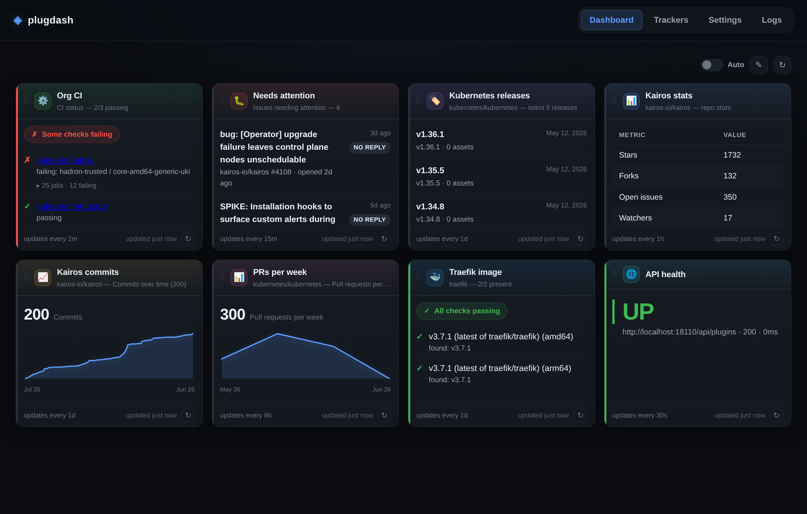
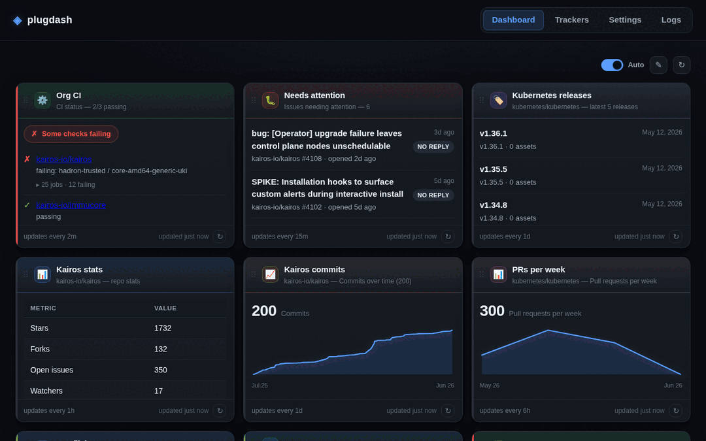

# plugdash

plugdash is a small, self-contained dashboard server. It runs **plugins** — each
plugin fetches data from some source (a GitHub repo, an HTTP endpoint, …) and
returns both the data and a **visualization type** that tells the web UI how to
render it. You configure plugins through a separate **Configure** section in the
UI, where you create and manage saved plugin configurations called **trackers**.
Trackers are persisted in a SQLite database, so the server is stateless apart
from that single file. The whole thing — API server and web UI — ships as one Go
binary with the frontend embedded.



> An org at a glance: CI status across repos, open issues needing attention,
> latest releases, activity charts, Docker image checks and endpoint health —
> each widget refreshing on its own cadence, colour-coded by health.

### A quick tour



## Documentation

Full docs live in [`docs/`](docs/README.md):

| Doc | What |
| --- | --- |
| [docs/README.md](docs/README.md) | Documentation index + 60-second quick start |
| [ARCHITECTURE.md](docs/ARCHITECTURE.md) | System design, components, data flow |
| [PLUGIN_CATALOG.md](docs/PLUGIN_CATALOG.md) | Every built-in plugin + config + examples |
| [VISUALIZATIONS.md](docs/VISUALIZATIONS.md) | Visualization types & data shapes |
| [PLUGINS.md](docs/PLUGINS.md) | Writing a plugin (Go + external/any-language) |
| [API.md](docs/API.md) | REST API reference |
| [CONFIGURATION.md](docs/CONFIGURATION.md) | Flags, env vars, settings, tokens |
| [DEPLOYMENT.md](docs/DEPLOYMENT.md) | Running, Docker, reverse proxy |
| [DEVELOPMENT.md](docs/DEVELOPMENT.md) | Dev setup, add-a-plugin walkthrough |
| [FRONTEND.md](docs/FRONTEND.md) | The embedded SPA internals |
| [TROUBLESHOOTING.md](docs/TROUBLESHOOTING.md) | Problems, fixes & FAQ |
| [CONTRIBUTING.md](CONTRIBUTING.md) | How to contribute |

## Architecture

A plugin describes itself (id, name, config schema) and exposes a `Run` method.
The registry holds the available plugins. The store persists trackers (a plugin
id plus a user-supplied config) in SQLite. The HTTP server exposes a small REST
API over the registry and store, and serves the embedded web UI which renders
each tracker's `Run` result according to its visualization type.

```
                        +------------------+
   browser  <--HTTP-->  |   HTTP server    |  (internal/server)
   (web UI)             |  REST API + UI   |
                        +---------+--------+
                                  |
                 +----------------+----------------+
                 |                                 |
        +--------v---------+              +--------v---------+
        |    Registry      |              |      Store       |
        | (plugin.Registry)|              |  (SQLite-backed) |
        +--------+---------+              +--------+---------+
                 |                                 |
        +--------v---------+              +--------v---------+
        |     Plugins      |              |    trackers      |
        | implement the    |              | (plugin_id +     |
        | plugin.Plugin    |              |  saved config)   |
        | interface        |              +------------------+
        +------------------+

  embedded web UI lives in web/assets (web.FS()), served at "/"
```

- **Plugin interface** (`internal/plugin/plugin.go`): the contract every data
  source implements. `Run(ctx, cfg)` returns a `Result{Visualization, Title, Data}`.
- **Registry** (`internal/plugin/registry.go`): an in-memory, concurrency-safe
  map of plugins keyed by `ID()`. Plugins are registered at startup in
  `cmd/plugdash/main.go`.
- **Store** (`internal/store/store.go`): SQLite-backed CRUD for trackers. Uses
  the pure-Go `modernc.org/sqlite` driver (no CGO).
- **HTTP server** (`internal/server/server.go`): the REST API plus a file server
  for the embedded UI.
- **Web UI** (`web/web.go`, `web/assets/`): static assets embedded into the
  binary via `go:embed`.

## Quick start

```sh
go build ./cmd/plugdash
./plugdash
```

Or with Docker (multi-arch images are published to GHCR on each release):

```sh
docker run -p 8080:8080 -v plugdash-data:/data ghcr.io/<owner>/plugdash:latest
```

Then open <http://localhost:8080> in your browser. Use the **Configure** section
to add a tracker (pick a plugin, fill in its fields, save), and it will appear on
the dashboard. Set a **GitHub token** in **Settings** to raise the API rate limit.

## Refresh & auto-refresh

The dashboard has a global **auto-refresh** toggle and interval. That interval is
the dashboard's *polling tick* — how often it checks whether any widgets are due
to be re-run.

Each widget, however, refreshes on **its own plugin-declared cadence**: every
plugin reports a `RefreshInterval()` (surfaced over the API as
`refresh_interval_seconds`), and the dashboard treats that value as a per-widget
floor. So a cheap, volatile source (an HTTP health check, ~30s) re-runs often,
while an expensive, slow-moving one (releases or star history, ~daily) is not
hammered on every tick. Each widget shows its own cadence, and a **force-refresh
button** on the widget re-runs it immediately, ignoring the interval.

Dashboard cards are **drag-and-drop reorderable**, and the chosen order
**persists** across reloads.

### Flags

| Flag    | Default       | Purpose                              |
| ------- | ------------- | ------------------------------------ |
| `-addr` | `:8080`       | HTTP listen address.                 |
| `-db`   | `plugdash.db` | Path to the SQLite database file. Resolved to an absolute path at startup; created if it does not exist. |
| `-plugins-dir` | _(see below)_ | Directory of external plugin executables. Defaults to `$PLUGDASH_PLUGINS_DIR`, else `~/.config/plugdash/plugins`. |
| `-debug` | `false` | Verbose logging (each run, outbound queries, plugin output). Also via `PLUGDASH_DEBUG=1` or the Settings toggle. |

```sh
./plugdash -addr :9000 -db /var/lib/plugdash/data.db
```

### GitHub token (recommended)

The GitHub plugins work unauthenticated but GitHub limits anonymous calls to
**60 requests/hour** — easy to exhaust with several widgets. A token raises this
to **5000/hour**, so it is strongly recommended. Three ways to set one (first
match wins): a per-tracker `token` config field, the **GitHub token** field in
**Settings** (stored and applied to all GitHub widgets), or the `GITHUB_TOKEN`
environment variable:

```sh
export GITHUB_TOKEN=ghp_xxxxxxxxxxxxxxxxxxxx
./plugdash
```

A per-tracker `token` field takes precedence; when it is empty the plugin falls
back to `GITHUB_TOKEN`.

## Refresh cadence & logs

Each **tracker** refreshes on its own cadence. When you add or edit a tracker the
refresh interval is prefilled with the plugin's declared default and you can
override it per tracker. The dashboard arms one timer per widget at its own
interval (a cheap health check every 30s, a release tracker daily). The
**Auto-refresh** toggle on the Dashboard is the master on/off; there is no single
global interval. Each widget also has a force-refresh button and shows its
cadence.

**Logs & debug.** Turn on debug logging via `-debug`, `PLUGDASH_DEBUG=1`, or the
Settings toggle. The **Logs** tab shows recent entries from an in-memory ring
(`GET /api/logs`): each run start/finish with timings, every outbound GitHub /
registry query, and external-plugin stderr. Built-in plugins log through a
context logger; external plugins just write to stderr (and get `PLUGDASH_DEBUG`
passed through).

## REST API

All endpoints return JSON. Errors are returned as `{"error": "..."}` with an
appropriate status code.

| Method   | Path                       | Purpose                                            |
| -------- | -------------------------- | -------------------------------------------------- |
| `GET`    | `/api/plugins`             | List available plugins and their config schemas.   |
| `GET`    | `/api/trackers`            | List all saved trackers.                           |
| `POST`   | `/api/trackers`            | Create a tracker.                                  |
| `DELETE` | `/api/trackers/{id}`       | Delete a tracker. `204` on success, `404` if missing. |
| `GET`    | `/api/trackers/{id}/run`   | Run a tracker and return its result (or error).    |
| `GET`    | `/`                        | The embedded web UI (static assets).               |

### `GET /api/plugins`

Returns the registered plugins. Each entry carries the schema the UI uses to
render a configuration form, plus `refresh_interval_seconds` — the plugin's
declared auto-refresh cadence (from `RefreshInterval()`), in whole seconds.

```json
[
  {
    "id": "github-releases",
    "name": "GitHub Releases",
    "description": "Track the latest releases of a GitHub repository.",
    "refresh_interval_seconds": 86400,
    "schema": [
      {
        "key": "repo",
        "label": "Repository",
        "type": "string",
        "required": true,
        "placeholder": "owner/repo",
        "help": "GitHub repository as owner/repo or full URL."
      }
    ]
  }
]
```

### `GET /api/trackers`

```json
[
  {
    "id": 1,
    "plugin_id": "github-releases",
    "name": "kubernetes releases",
    "config": { "repo": "kubernetes/kubernetes", "count": 5 },
    "created_at": "2026-06-02T10:00:00Z"
  }
]
```

### `POST /api/trackers`

Request body:

```json
{
  "plugin_id": "github-releases",
  "name": "kubernetes releases",
  "config": { "repo": "kubernetes/kubernetes", "count": 5 }
}
```

`plugin_id` is required and must match a registered plugin (otherwise `400`). If
`name` is empty it defaults to the `plugin_id`. Responds `201` with the created
tracker:

```json
{
  "id": 1,
  "plugin_id": "github-releases",
  "name": "kubernetes releases",
  "config": { "repo": "kubernetes/kubernetes", "count": 5 },
  "created_at": "2026-06-02T10:00:00Z"
}
```

Example:

```sh
curl -X POST http://localhost:8080/api/trackers \
  -H 'Content-Type: application/json' \
  -d '{"plugin_id":"github-releases","name":"k8s","config":{"repo":"kubernetes/kubernetes","count":5}}'
```

### `DELETE /api/trackers/{id}`

```sh
curl -X DELETE http://localhost:8080/api/trackers/1
```

Returns `204 No Content` on success, `404` if the tracker does not exist.

### `GET /api/trackers/{id}/run`

Executes the tracker's plugin (with a 30-second timeout) and returns the result.
A plugin error is captured in the `error` field rather than failing the request,
so the response is always `200` for an existing tracker.

The response also includes `refresh_interval_seconds` — the plugin's declared
auto-refresh cadence in whole seconds — so the UI knows how often to re-run this
widget automatically.

```json
{
  "tracker_id": 1,
  "name": "kubernetes releases",
  "plugin_id": "github-releases",
  "refresh_interval_seconds": 86400,
  "result": {
    "visualization": "list",
    "title": "kubernetes/kubernetes — latest 5 releases",
    "data": {
      "items": [
        {
          "title": "v1.30.0",
          "subtitle": "v1.30.0 · 12 assets",
          "url": "https://github.com/kubernetes/kubernetes/releases/tag/v1.30.0",
          "timestamp": "2026-05-01"
        }
      ]
    }
  }
}
```

On a plugin failure:

```json
{
  "tracker_id": 1,
  "name": "kubernetes releases",
  "plugin_id": "github-releases",
  "error": "github /repos/... returned 404: Not Found"
}
```

## Built-in plugins

Plugins registered by default in `cmd/plugdash/main.go`:

### GitHub Releases — `github-releases` (visualization: `list`)

Tracks the most recent releases of a repository.

| Key     | Label                    | Type     | Required | Default | Notes |
| ------- | ------------------------ | -------- | -------- | ------- | ----- |
| `repo`  | Repository               | `string` | yes      | —       | `owner/repo` or a full GitHub URL. |
| `count` | Number of releases       | `number` | no       | `5`     | How many recent releases to show. |
| `token` | GitHub token (optional)  | `string` | no       | —       | Raises rate limits; falls back to `GITHUB_TOKEN`. |

### GitHub Release Artifacts — `github-release-artifacts` (visualization: `checklist`)

Checks that a release contains an expected set of artifacts (with `*`/`?` glob
support).

| Key        | Label                   | Type     | Required | Notes |
| ---------- | ----------------------- | -------- | -------- | ----- |
| `repo`     | Repository              | `string` | yes      | `owner/repo` or full URL. |
| `tag`      | Release tag             | `string` | no       | Tag to check; empty or `latest` uses the most recent release. |
| `expected` | Expected artifacts      | `list`   | yes      | One artifact name per line; supports `*` and `?` glob wildcards. |
| `token`    | GitHub token (optional) | `string` | no       | Raises rate limits; falls back to `GITHUB_TOKEN`. |

### More built-in plugins

These are also registered by default in `cmd/plugdash/main.go`.

#### GitHub Repo Stats — `github-repo-stats` (visualization: `table`)

Shows stars, forks, open issues, watchers and language for a repository.

| Key     | Label        | Type     | Required | Notes |
| ------- | ------------ | -------- | -------- | ----- |
| `repo`  | Repository   | `string` | yes      | `owner/repo` or full URL. |
| `token` | GitHub token | `string` | no       | Falls back to `GITHUB_TOKEN`. |

#### HTTP Health Check — `http-health` (visualization: `stat`)

Checks that an HTTP endpoint is reachable and returns the expected status code.
A failed request or unexpected status is reported as a result (UP / DOWN /
status code), not an error.

| Key               | Label             | Type     | Required | Default | Notes |
| ----------------- | ----------------- | -------- | -------- | ------- | ----- |
| `url`             | URL               | `string` | yes      | —       | `https://` is assumed if no scheme is given. |
| `expected_status` | Expected status   | `number` | no       | `200`   | Expected HTTP status code. |
| `timeout_seconds` | Timeout (seconds) | `number` | no       | `10`    | Per-request timeout. |

#### RSS / Atom Feed — `rss-feed` (visualization: `list`)

Shows the latest entries from an RSS 2.0 or Atom feed.

| Key     | Label             | Type     | Required | Default | Notes |
| ------- | ----------------- | -------- | -------- | ------- | ----- |
| `url`   | Feed URL          | `string` | yes      | —       | URL of an RSS 2.0 or Atom feed. |
| `count` | Number of entries | `number` | no       | `5`     | How many recent entries to show. |

#### GitHub Actions Status — `github-actions-status` (visualization: `checklist`)

A birds-eye CI view across many repositories. For each repo it reports whether
the latest commit on the default (or a chosen) branch is passing CI, as reported
by the GitHub Actions / checks API. Each checklist item links to the relevant
run or repo. Default refresh interval: **2 minutes**.

| Key      | Label        | Type     | Required | Notes |
| -------- | ------------ | -------- | -------- | ----- |
| `repos`  | Repositories | `list`   | yes      | One `owner/repo` per line. |
| `branch` | Branch       | `string` | no       | Leave empty to use each repo's default branch. |
| `token`  | GitHub Token | `string` | no       | Falls back to `GITHUB_TOKEN`. |

#### GitHub Activity Over Time — `github-activity` (visualization: `timeseries`)

Plots a repository's **stars, commits, issues, or pull requests** over time as a
cumulative line chart. The series is computed **live** on every run from the
timestamps GitHub attaches to each item (nothing is persisted between runs); the
daily cumulative series is downsampled to fit the chart. Default refresh
interval: **24 hours**.

| Key         | Label        | Type     | Required | Default | Notes |
| ----------- | ------------ | -------- | -------- | ------- | ----- |
| `repo`      | Repository   | `string` | yes      | —       | `owner/repo` or full URL. |
| `metric`    | Metric       | `select` | no       | `stars` | One of `stars`, `commits`, `issues`, `prs`. |
| `token`     | GitHub token | `string` | no       | —       | Falls back to `GITHUB_TOKEN`. |
| `max_pages` | Max pages    | `number` | no       | `30`    | Pages of 100 items to fetch; caps history depth and API usage. |

> Note: commits/issues/PRs are fetched newest-first, so for very active repos the
> chart reflects the most recent `max_pages × 100` items.

#### GitHub Activity Rate — `github-activity-rate` (visualization: `timeseries`)

Plots **how many** commits / issues / PRs / stars happened **per day, week or
month** (per-period counts, not cumulative) — the activity rhythm of a repo.
Default refresh interval: **6 hours**.

| Key         | Label      | Type     | Required | Default   | Notes |
| ----------- | ---------- | -------- | -------- | --------- | ----- |
| `repo`      | Repository | `string` | yes      | —         | `owner/repo`. |
| `metric`    | Metric     | `select` | no       | `commits` | `stars`/`commits`/`issues`/`prs`. |
| `period`    | Period     | `select` | no       | `week`    | `day`/`week`/`month`; quiet periods show as 0. |
| `token`     | GitHub token | `string` | no     | —         | Falls back to `GITHUB_TOKEN`. |
| `max_pages` | Max pages  | `number` | no       | `20`      | Pages of 100 items; caps the window. |

#### Issues Needing Attention — `github-issues` (visualization: `list`)

Lists the latest **open issues with no response yet** (zero comments) across one
or more repos — a birds-eye of what needs triage. PRs are excluded. Default
refresh interval: **15 minutes**.

| Key               | Label            | Type     | Required | Default | Notes |
| ----------------- | ---------------- | -------- | -------- | ------- | ----- |
| `repos`           | Repositories     | `list`   | yes      | —       | One `owner/repo` per line. |
| `unanswered_only` | Unanswered only  | `bool`   | no       | `true`  | Only issues with zero comments. |
| `count`           | Max issues       | `number` | no       | `10`    | Total issues to show. |
| `token`           | GitHub token     | `string` | no       | —       | Falls back to `GITHUB_TOKEN`. |

#### Docker Image Check — `docker-image` (visualization: `checklist`)

Checks whether Docker images exist in a registry for a set of tags and
architectures. Supports Docker Hub (`nginx`, `org/img`) and `ghcr.io`, plus a
generic Docker Registry v2 bearer-token fallback. Multi-arch presence is read
from the manifest list/OCI index; a single-arch (non-index) tag is reported as
present with the arch left "unverified". Default refresh interval: **24 hours**.

Tags can be listed manually and/or derived from a GitHub repo's latest stable
release (the `/releases/latest` tag). A derived tag is checked in both its
`vX.Y.Z` and `X.Y.Z` forms and passes if either image tag exists — handy when
your Docker tags drop the leading `v`. At least one of `tags` / `tag_source` is
required.

| Key            | Label                | Type     | Required | Notes |
| -------------- | -------------------- | -------- | -------- | ----- |
| `image`        | Image                | `string` | yes      | Image ref without a tag, e.g. `ghcr.io/org/repo` or `nginx`. |
| `tags`         | Tags                 | `list`   | no*      | One tag per line. |
| `tag_source`   | Tag from GitHub repo | `string` | no*      | `owner/repo`; also checks its latest stable release tag (both `vX.Y.Z` and `X.Y.Z`). |
| `arches`       | Architectures        | `list`   | no       | e.g. `amd64`, `arm64`. Empty = only check tag existence. |
| `token`        | Registry token       | `string` | no       | Bearer token for private images. |
| `github_token` | GitHub token         | `string` | no       | Used only to resolve `tag_source`. Falls back to `GITHUB_TOKEN`. |

\* Provide `tags`, `tag_source`, or both.

## Writing a plugin

See [`docs/PLUGINS.md`](docs/PLUGINS.md) for a guide to implementing and
registering your own plugin.

### External plugins (any language)

You don't have to write Go or recompile. Drop an executable named
`plugdash-plugin-*` into the plugins directory (see `-plugins-dir` above) and
plugdash discovers it at startup — or via the **Rescan plugins** button in
Settings / `POST /api/plugins/rescan`. The executable answers two subcommands:
`describe` (prints metadata + config schema JSON) and `run` (reads config JSON on
stdin, prints a Result JSON). External plugins behave exactly like built-ins in
the UI and are flagged `external` in `GET /api/plugins`.

A minimal, dependency-free Python example is in
[`examples/plugins/plugdash-plugin-example`](examples/plugins/plugdash-plugin-example).
Full protocol in [`docs/PLUGINS.md`](docs/PLUGINS.md#7-external-plugins-any-language).
(The "track a value in a file" idea is also available as the built-in
`file-version` plugin, so it works in every deployment without an interpreter.)

## Running tests

```sh
go test ./...
```
