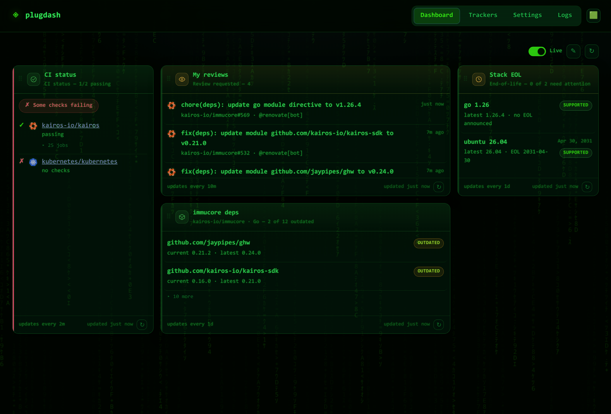

# plugdash

plugdash is a small, self-contained dashboard server. It runs **plugins** — each
plugin fetches data from some source (a GitHub repo, an HTTP endpoint, …) and
returns both the data and a **visualization type** that tells the web UI how to
render it. You configure plugins through a separate **Configure** section in the
UI, where you create and manage saved plugin configurations called **trackers**.
Trackers are persisted in a SQLite database, so the server is stateless apart
from that single file. The whole thing — API server and web UI — ships as one Go
binary with the frontend embedded.


> An org at a glance: CI status across repos, open issues needing attention,
> latest releases, activity charts, Docker image checks and endpoint health —
> each widget refreshing on its own cadence, colour-coded by health.

### Highlights

- **A library of widgets.** ~20 built-in plugins — GitHub releases/PRs/issues/CI/
  activity/milestones, a review queue, stale-item and end-of-life trackers,
  dependency-freshness and OSV vulnerability checks, HTTP health, RSS, Docker
  image checks, and more. See [docs/PLUGIN_CATALOG.md](docs/PLUGIN_CATALOG.md).
- **Per-widget sizing & text size.** Widgets can ask for a wider/taller tile, and
  a per-browser text-size preference packs more info per card or makes it easier
  to read.
- **Themes.** Dark, light, and a green-CRT **matrix** theme — pick one (with a
  live preview) in **Settings → Themes** — or drop your own CSS file in the
  themes dir to re-skin the whole UI. See [docs/THEMES.md](docs/THEMES.md).
- **Live updates over SSE.** The browser subscribes to a stream
  (`/api/stream`) and results are pushed as they're ready — no manual reload.
  A **Live** toggle (on by default) controls it.
- **Server-side, shared execution.** Trackers run on the *server* on their own
  cadence; the latest result is cached and shared by every client, so a hundred
  viewers cost one upstream call, not a hundred. Real-time only (no history).
- **Presence-gated efficiency.** The server only refreshes while someone is
  actually watching (an SSE client is connected, or there's been a recent
  `/api/run` poll within 20s). With nobody watching it idles and makes **zero**
  upstream API calls.
- **Config-as-code.** Point `--config` at a YAML file to declare trackers
  declaratively; they're reconciled into the DB and carry a `config` badge in the
  UI (not editable from the UI, but deletable — a reload restores them). Users can
  still add their own trackers through the UI — a hybrid model. The Trackers view
  can also **clear** all trackers, **reload** from the config file, **load** an
  uploaded/pasted config (session-only), and **dump** the current trackers to a
  config file. See [docs/CONFIGURATION.md](docs/CONFIGURATION.md) and
  [examples/plugdash.yaml](examples/plugdash.yaml).

### A quick tour


## Documentation

Full docs live in [`docs/`](docs/README.md):

| Doc | What |
| --- | --- |
| [docs/README.md](docs/README.md) | Documentation index + 60-second quick start |
| [ARCHITECTURE.md](docs/ARCHITECTURE.md) | System design, components, data flow |
| [PLUGIN_CATALOG.md](docs/PLUGIN_CATALOG.md) | Every built-in plugin + config + examples |
| [VISUALIZATIONS.md](docs/VISUALIZATIONS.md) | Visualization types & data shapes |
| [THEMES.md](docs/THEMES.md) | Built-in themes + adding your own (drop a CSS file) |
| [PLUGINS.md](docs/PLUGINS.md) | Writing a plugin (Go + external/any-language) |
| [API.md](docs/API.md) | REST API reference |
| [CONFIGURATION.md](docs/CONFIGURATION.md) | Flags, env vars, settings, tokens |
| [DEPLOYMENT.md](docs/DEPLOYMENT.md) | Running, Docker, reverse proxy |
| [DEVELOPMENT.md](docs/DEVELOPMENT.md) | Dev setup, add-a-plugin walkthrough |
| [FRONTEND.md](docs/FRONTEND.md) | The embedded SPA internals |
| [TROUBLESHOOTING.md](docs/TROUBLESHOOTING.md) | Problems, fixes & FAQ |
| [CONTRIBUTING.md](CONTRIBUTING.md) | How to contribute |

## Architecture

A plugin describes itself (id, name, config schema) and exposes a `Run` method.
The registry holds the available plugins. The store persists trackers (a plugin
id plus a user-supplied config) in SQLite. The HTTP server exposes a small REST
API over the registry and store, and serves the embedded web UI which renders
each tracker's `Run` result according to its visualization type.

```
                        +------------------+
   browser  <--HTTP-->  |   HTTP server    |  (internal/server)
   (web UI)             |  REST API + UI   |
                        +---------+--------+
                                  |
                 +----------------+----------------+
                 |                                 |
        +--------v---------+              +--------v---------+
        |    Registry      |              |      Store       |
        | (plugin.Registry)|              |  (SQLite-backed) |
        +--------+---------+              +--------+---------+
                 |                                 |
        +--------v---------+              +--------v---------+
        |     Plugins      |              |    trackers      |
        | implement the    |              | (plugin_id +     |
        | plugin.Plugin    |              |  saved config)   |
        | interface        |              +------------------+
        +------------------+

  embedded web UI lives in web/assets (web.FS()), served at "/"
```

- **Plugin interface** (`internal/plugin/plugin.go`): the contract every data
  source implements. `Run(ctx, cfg)` returns a `Result{Visualization, Title, Data}`.
- **Registry** (`internal/plugin/registry.go`): an in-memory, concurrency-safe
  map of plugins keyed by `ID()`. Plugins are registered at startup in
  `cmd/plugdash/main.go`.
- **Store** (`internal/store/store.go`): SQLite-backed CRUD for trackers. Uses
  the pure-Go `modernc.org/sqlite` driver (no CGO).
- **HTTP server** (`internal/server/server.go`): the REST API plus a file server
  for the embedded UI.
- **Web UI** (`web/web.go`, `web/assets/`): static assets embedded into the
  binary via `go:embed`.

## Quick start

```sh
go build ./cmd/plugdash
./plugdash
```

Or with Docker (multi-arch images are published to GHCR on each release):

```sh
docker run -p 8080:8080 -v plugdash-data:/data ghcr.io/<owner>/plugdash:latest
```

Then open <http://localhost:8080> in your browser. Use the **Configure** section
to add a tracker (pick a plugin, fill in its fields, save), and it will appear on
the dashboard. Set a **GitHub token** in **Settings** to raise the API rate limit.

## Refresh & live updates

Trackers run on the **server**, not in the browser. A server-side engine runs
each tracker on **its own plugin-declared cadence**: every plugin reports a
`RefreshInterval()` (surfaced over the API as `refresh_interval_seconds`), so a
cheap, volatile source (an HTTP health check, ~30s) re-runs often while an
expensive, slow-moving one (releases or star history, ~daily) is not hammered.
The latest result for each tracker is **cached and shared by all clients**, so N
viewers cost one upstream call rather than N. Results are real-time only — no
history is kept.

New results are **pushed to the browser over Server-Sent Events** (`/api/stream`)
as soon as they're ready. A **Live** toggle (on by default) on the Dashboard
controls the stream; a **force-refresh button** on each widget re-runs it
immediately, ignoring the cadence, and each widget shows its own interval.

The engine is **presence-gated**: it only refreshes while someone is watching —
an SSE client is connected, or there's been a recent `/api/run` poll within the
last 20 seconds. When nobody is looking it idles and makes **zero** upstream API
calls.

Dashboard cards are **drag-and-drop reorderable**, and the chosen order
**persists** across reloads.

### Flags

| Flag    | Default       | Purpose                              |
| ------- | ------------- | ------------------------------------ |
| `-addr` | `:8080`       | HTTP listen address.                 |
| `-db`   | `plugdash.db` | Path to the SQLite database file. Resolved to an absolute path at startup; created if it does not exist. |
| `-plugins-dir` | _(see below)_ | Directory of external plugin executables. Defaults to `$PLUGDASH_PLUGINS_DIR`, else `~/.config/plugdash/plugins`. |
| `-themes-dir` | _(see below)_ | Directory of user theme CSS files. Defaults to `$PLUGDASH_THEMES_DIR`, else `~/.config/plugdash/themes`. See [docs/THEMES.md](docs/THEMES.md). |
| `-config` | _(none)_ | Path to a declarative config file (YAML, "config-as-code"). Trackers in it are reconciled into the DB and carry a `config` badge (not editable from the UI, but deletable — a reload restores them). See [docs/CONFIGURATION.md](docs/CONFIGURATION.md). |
| `-debug` | `false` | Verbose logging (each run, outbound queries, plugin output). Also via `PLUGDASH_DEBUG=1` or the Settings toggle. |
| `-version` | `false` | Print the version and exit. |

```sh
./plugdash -addr :9000 -db /var/lib/plugdash/data.db
```

### GitHub token (recommended)

The GitHub plugins work unauthenticated but GitHub limits anonymous calls to
**60 requests/hour** — easy to exhaust with several widgets. A token raises this
to **5000/hour**, so it is strongly recommended. Three ways to set one (first
match wins): a per-tracker `token` config field, the **GitHub token** field in
**Settings** (stored and applied to all GitHub widgets), or the `GITHUB_TOKEN`
environment variable:

```sh
export GITHUB_TOKEN=ghp_xxxxxxxxxxxxxxxxxxxx
./plugdash
```

A per-tracker `token` field takes precedence; when it is empty the plugin falls
back to `GITHUB_TOKEN`.

## Refresh cadence & logs

Each **tracker** refreshes on its own cadence. When you add or edit a tracker the
refresh interval is prefilled with the plugin's declared default and you can
override it per tracker. The server-side engine runs one schedule per tracker at
its own interval (a cheap health check every 30s, a release tracker daily) and
pushes results to the browser over SSE. The **Live** toggle on the Dashboard
controls the stream; each widget also has a force-refresh button and shows its
cadence.

**Logs & debug.** Turn on debug logging via `-debug`, `PLUGDASH_DEBUG=1`, or the
Settings toggle. The **Logs** tab shows recent entries from an in-memory ring
(`GET /api/logs`): each run start/finish with timings, every outbound GitHub /
registry query, and external-plugin stderr. Built-in plugins log through a
context logger; external plugins just write to stderr (and get `PLUGDASH_DEBUG`
passed through).

## REST API

All endpoints return JSON. Errors are returned as `{"error": "..."}` with an
appropriate status code.

| Method   | Path                       | Purpose                                            |
| -------- | -------------------------- | -------------------------------------------------- |
| `GET`    | `/api/plugins`             | List available plugins and their config schemas.   |
| `POST`   | `/api/plugins/rescan`      | Re-scan the external plugins directory.            |
| `GET`    | `/api/trackers`            | List all saved trackers.                           |
| `POST`   | `/api/trackers`            | Create a tracker.                                  |
| `PUT`    | `/api/trackers/{id}`       | Update a tracker. `403` if managed by config (`source="file"`, not editable). |
| `DELETE` | `/api/trackers/{id}`       | Delete a tracker (file-managed ones included). `204` on success, `404` if missing. |
| `POST`   | `/api/trackers/clear`      | Delete every tracker (db + file).                  |
| `POST`   | `/api/trackers/reload`     | Re-reconcile trackers from the `--config` file (`409` if none). |
| `POST`   | `/api/trackers/import`     | Load trackers from a config document in the body (session-only). |
| `GET`    | `/api/trackers/export`     | Download the current trackers as a config YAML.    |
| `GET`    | `/api/trackers/{id}/run`   | Return the cached snapshot for a tracker; `?force=true` enqueues an immediate re-run. |
| `GET`    | `/api/run`                 | Return the cached snapshots for all trackers (counts as a presence poll). |
| `GET`    | `/api/stream`              | Server-Sent Events stream of snapshot frames.      |
| `GET`    | `/api/config`              | Whether a declarative config file is configured.   |
| `GET`    | `/api/settings`            | Get persisted settings (GitHub token, debug, widget sizing). |
| `PUT`    | `/api/settings`            | Update persisted settings.                         |
| `GET`    | `/api/logs`                | Recent log entries from the in-memory ring.        |
| `DELETE` | `/api/logs`                | Clear the in-memory log ring.                      |
| `GET`    | `/`                        | The embedded web UI (static assets).               |

### `GET /api/plugins`

Returns the registered plugins. Each entry carries the schema the UI uses to
render a configuration form, plus `refresh_interval_seconds` — the plugin's
declared auto-refresh cadence (from `RefreshInterval()`), in whole seconds.

```json
[
  {
    "id": "github-releases",
    "name": "GitHub Releases",
    "description": "Track the latest releases of a GitHub repository.",
    "refresh_interval_seconds": 86400,
    "schema": [
      {
        "key": "repo",
        "label": "Repository",
        "type": "string",
        "required": true,
        "placeholder": "owner/repo",
        "help": "GitHub repository as owner/repo or full URL."
      }
    ]
  }
]
```

### `GET /api/trackers`

```json
[
  {
    "id": 1,
    "plugin_id": "github-releases",
    "name": "kubernetes releases",
    "config": { "repo": "kubernetes/kubernetes", "count": 5 },
    "created_at": "2026-06-02T10:00:00Z"
  }
]
```

### `POST /api/trackers`

Request body:

```json
{
  "plugin_id": "github-releases",
  "name": "kubernetes releases",
  "config": { "repo": "kubernetes/kubernetes", "count": 5 }
}
```

`plugin_id` is required and must match a registered plugin (otherwise `400`). If
`name` is empty it defaults to the `plugin_id`. Responds `201` with the created
tracker:

```json
{
  "id": 1,
  "plugin_id": "github-releases",
  "name": "kubernetes releases",
  "config": { "repo": "kubernetes/kubernetes", "count": 5 },
  "created_at": "2026-06-02T10:00:00Z"
}
```

Example:

```sh
curl -X POST http://localhost:8080/api/trackers \
  -H 'Content-Type: application/json' \
  -d '{"plugin_id":"github-releases","name":"k8s","config":{"repo":"kubernetes/kubernetes","count":5}}'
```

### `DELETE /api/trackers/{id}`

```sh
curl -X DELETE http://localhost:8080/api/trackers/1
```

Returns `204 No Content` on success, `404` if the tracker does not exist.

### `GET /api/trackers/{id}/run`

Returns the latest cached snapshot for the tracker — the server-side engine runs
trackers on their own cadence and caches one result shared by all clients, so
this does **not** trigger a fresh upstream call by itself. Append `?force=true`
to enqueue an immediate re-run (the fresh result arrives over `/api/stream`). A
plugin error is captured in the `error` field rather than failing the request,
so the response is `200` for a tracker that has run. A tracker that has not run
yet returns `202` with `{"tracker_id": N, "pending": true}`; an unknown id is
`404`.

The snapshot includes `refresh_interval_seconds` — the plugin's effective
cadence in whole seconds — and `fetched_at`, the time the cached result was
produced. (See [docs/API.md](docs/API.md) for the full snapshot shape.)

```json
{
  "tracker_id": 1,
  "name": "kubernetes releases",
  "plugin_id": "github-releases",
  "refresh_interval_seconds": 86400,
  "fetched_at": "2026-06-02T10:00:00Z",
  "result": {
    "visualization": "list",
    "title": "kubernetes/kubernetes — latest 5 releases",
    "data": {
      "items": [
        {
          "title": "v1.30.0",
          "subtitle": "v1.30.0 · 12 assets",
          "url": "https://github.com/kubernetes/kubernetes/releases/tag/v1.30.0",
          "timestamp": "2026-05-01"
        }
      ]
    }
  }
}
```

On a plugin failure:

```json
{
  "tracker_id": 1,
  "name": "kubernetes releases",
  "plugin_id": "github-releases",
  "error": "github /repos/... returned 404: Not Found"
}
```

## Built-in plugins

plugdash ships ~20 built-in plugins, registered in `cmd/plugdash/main.go`. Full
config fields, behaviors and screenshots live in
[docs/PLUGIN_CATALOG.md](docs/PLUGIN_CATALOG.md).

| id | viz | Tracks |
|----|-----|--------|
| `github-releases` | list | Latest N releases of a repo |
| `github-release-artifacts` | checklist | A release contains the expected asset files |
| `github-repo-stats` | table | Stars, forks, open issues, watchers, language |
| `github-actions-status` | checklist | CI status of the latest commit across repos |
| `github-activity` | timeseries | Cumulative stars/commits/issues/PRs over time |
| `github-activity-rate` | timeseries | Per-period counts of stars/commits/issues/PRs |
| `github-issues` | list | Open issues needing a first reply across repos |
| `github-issue-watch` | list | Specific issues/PRs: answered state, last reply, CI |
| `github-prs` | list | Open PR review queue (review state + CI + draft) |
| `github-review-requested` | list | Open (non-draft) PRs awaiting your review |
| `github-stale` | list | Open issues/PRs with no activity for > N days |
| `github-milestone` | gauge | Milestone completion (issues closed vs total) |
| `github-workflow-health` | timeseries | CI success rate + run-duration trend |
| `dependency-freshness` | list | go.mod / package.json deps vs their latest releases |
| `endoflife` | list | End-of-life / support countdown (endoflife.date) |
| `osv-vulns` | list | Known vulnerabilities for a package version (OSV.dev) |
| `http-health` | stat | An HTTP endpoint is up and returns the expected status |
| `rss-feed` | list | Latest entries of an RSS 2.0 / Atom feed |
| `docker-image` | checklist | Image tags (and arches) exist in a registry |
| `file-version` | stat | A named variable's value in a file on a repo branch |

GitHub plugins fall back to `GITHUB_TOKEN`; `endoflife` and `osv-vulns` need no auth.

## Writing a plugin

See [`docs/PLUGINS.md`](docs/PLUGINS.md) for a guide to implementing and
registering your own plugin.

### External plugins (any language)

You don't have to write Go or recompile. Drop an executable named
`plugdash-plugin-*` into the plugins directory (see `-plugins-dir` above) and
plugdash discovers it at startup — or via the **Rescan plugins** button in
Settings / `POST /api/plugins/rescan`. The executable answers two subcommands:
`describe` (prints metadata + config schema JSON) and `run` (reads config JSON on
stdin, prints a Result JSON). External plugins behave exactly like built-ins in
the UI and are flagged `external` in `GET /api/plugins`.

A minimal, dependency-free Python example is in
[`examples/plugins/plugdash-plugin-example`](examples/plugins/plugdash-plugin-example).
Full protocol in [`docs/PLUGINS.md`](docs/PLUGINS.md#7-external-plugins-any-language).
(The "track a value in a file" idea is also available as the built-in
`file-version` plugin, so it works in every deployment without an interpreter.)

## Running tests

```sh
go test ./...
```

## License

Not yet chosen — treat as all rights reserved until a `LICENSE` is added.

---

<details>
<summary>🎮 You reached the end…</summary>

There's an easter egg. On the **Settings** page, enter the
[Konami code](https://en.wikipedia.org/wiki/Konami_Code):

```
↑ ↑ ↓ ↓ ← → ← → B A
```

Enjoy. Enter it again to turn it off. 🎉

And one more, for the console dwellers — open your browser devtools and run:

```js
plugdash.matrix()   // follow the white rabbit 🟩   (plugdash.unmatrix() to leave)
```



</details>
