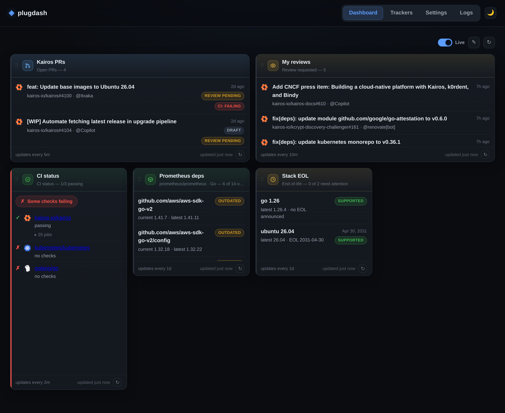

# plugdash Frontend

## Overview

The plugdash frontend is a **dependency-free, vanilla-JavaScript single-page
application**. There is no framework (no React/Vue/etc.), no bundler, and **no
build step** — the code that ships is exactly the code that runs in the browser.

It consists of three files under `web/assets/`:

- `index.html` — the page shell (topbar, nav, an empty `<main>`).
- `app.js` — the entire application (`"use strict"`, ~1850 lines).
- `style.css` — all styling.

The assets are embedded into the Go binary via `go:embed` and served from the
root of the embedded filesystem. From `web/web.go`:

```go
//go:embed assets
var embedded embed.FS

// FS returns the frontend asset filesystem rooted so that index.html is at "/".
func FS() fs.FS {
    sub, _ := fs.Sub(embedded, "assets")
    return sub
}
```

So `index.html` is served at `/`, `/app.js` and `/style.css` resolve from the
same embedded tree. `index.html` references them with absolute paths
(`<link rel="stylesheet" href="/style.css">`, `<script src="/app.js">`).

Because everything is embedded and self-contained, the app **works fully
offline**: there are no CDN script/style references and no remote web fonts —
all styling is local CSS, and all glyphs/icons are Unicode characters (emoji and
symbols like `↻`, `✎`, `⠿`). The only network traffic the SPA generates is to
the dashboard's own `/api/*` endpoints — including a long-lived SSE connection
to `/api/stream` while the dashboard is open (see "Live-update client" below) — plus
any outbound calls those endpoints make server-side, and links the user
explicitly opens.

## DOM helpers and the API wrapper

### `el(tag, attrs, children)`

A tiny hyperscript-style element factory used everywhere instead of HTML
templating. It creates a `tag`, then applies `attrs`:

- `class` → `node.className`
- `text` → `node.textContent`
- `html` → `node.innerHTML`
- a key starting with `on` whose value is a function → an event listener
  (`onClick`/`onclick` both work; the handler is registered for
  `k.slice(2).toLowerCase()`)
- a value of `true` → a boolean attribute (`setAttribute(k, "")`)
- `null`/`false` values are skipped
- anything else → `setAttribute(k, v)`

`children` may be a single node/string or an array; strings become text nodes,
`null`/`false` entries are skipped. This null-skipping is what allows the
conditional `cond ? el(...) : null` pattern used throughout.

### `clear(node)`

Removes all children of a node (`while (node.firstChild) ...`). Used to reset
`<main>` on view changes and to re-fill card bodies and panels.

### `api(path, opts)` and the `API` object

`api()` is a thin `fetch` wrapper that:

- throws an `Error` on non-OK responses, with a message of
  `"<status> <statusText> — <body text>"`;
- returns `null` for `204 No Content`;
- parses JSON when the `content-type` is `application/json`, otherwise returns
  text.

`API` is the typed surface of named methods over the backend REST endpoints:

| Method | HTTP / endpoint |
| --- | --- |
| `API.plugins()` | `GET /api/plugins` |
| `API.trackers()` | `GET /api/trackers` |
| `API.createTracker(body)` | `POST /api/trackers` (JSON) |
| `API.updateTracker(id, body)` | `PUT /api/trackers/:id` (JSON) |
| `API.deleteTracker(id)` | `DELETE /api/trackers/:id` |
| `API.runTracker(id)` | `GET /api/trackers/:id/run` |
| `API.run()` | `GET /api/run` — current snapshots for every tracker (one-shot hydrate / poll fallback) |
| `API.forceTracker(id)` | `GET /api/trackers/:id/run?force=true` — ask the engine to re-run one tracker now |
| `API.rescanPlugins()` | `POST /api/plugins/rescan` |
| `API.getLogs()` | `GET /api/logs` |
| `API.clearLogs()` | `DELETE /api/logs` |
| `API.getSettings()` | `GET /api/settings` |
| `API.saveSettings(body)` | `PUT /api/settings` (JSON) |

IDs are passed through `encodeURIComponent`.

### Live-update client — `startUpdates` / `stopUpdates`

Runs are **server-driven**: the backend engine executes trackers on their
cadence and pushes results; the client no longer schedules its own runs. Two
module-level functions manage the live connection (state lives in `streamSource`
for the `EventSource`, `pollTimer` for the fallback loop, and `onSnapshot` for
the current handler):

- **`startUpdates(handler)`** — tears down any existing connection, then opens an
  `EventSource` on `/api/stream`. Each pushed `snapshot` event is `JSON.parse`d
  (malformed frames ignored) and passed to `handler(snapshot)`, where `snapshot`
  has the same shape as a `/api/run` array element. On connect the server
  **replays** the current snapshots, so cards fill immediately. If the
  `EventSource` errors and ends up `CLOSED` (auto-reconnect gave up), or the
  browser lacks `EventSource`, it falls back to **`startPoll`** — `API.run()`
  immediately, then `setInterval` every **8s** — dispatching each snapshot
  through the same `handler`.
- **`stopUpdates()`** — closes the `EventSource`, clears the poll timer, and
  nulls `onSnapshot`. Called whenever the dashboard is torn down or another view
  is entered, so the server can notice the watcher left.

## Views and routing

There are **four views**, declared in `VIEWS`:

```js
const VIEWS = ["dashboard", "configure", "settings", "logs"];
```

- **dashboard** — the widget grid (`renderDashboard`).
- **configure** — labelled **"Trackers"** in the nav; add/edit/remove widgets
  (`renderConfigure`).
- **settings** — dashboard preferences (`renderSettings`).
- **logs** — the run log (`renderLogs`).

### `setView(view)`

The single entry point for switching views. It:

1. Falls back to `"dashboard"` for any unknown view.
2. Updates `currentView`.
3. Syncs the URL hash (`location.hash = view`) so views are **deep-linkable**.
4. Sets `main.className = "main view-" + view` (see below).
5. Tears down the live connection via `stopUpdates()` and the Logs poll via
   `clearLogsTimer()`.
6. Toggles the `.active` class on the matching nav button.
7. Dispatches to the view's render function.

### Hash routing

Routing is hash-based (`#dashboard`, `#configure`, `#settings`, `#logs`):

- The nav bar (`#nav`) uses event delegation: a click on a `.nav-btn` reads its
  `data-view` and calls `setView`.
- A `hashchange` listener handles back/forward navigation and pasted deep links,
  calling `setView` when the hash names a known, different view.
- On load, the app honors a deep-linked hash: `setView(location.hash.slice(1)
  || "dashboard")`.

### Per-view `<main>` class

`setView` sets `main.className` to `view-<name>`, and CSS uses that to size the
layout. The dashboard is allowed to be wide so it can fit many widget columns;
the form-centric views are constrained and centered:

```css
.main { max-width: 2200px; margin: 0 auto; padding: 28px 28px 64px; }
.main.view-configure,
.main.view-settings { max-width: 1040px; }
```

## Dashboard rendering

`renderDashboard` builds a slim right-aligned toolbar (`.dash-toolbar`)
containing the **Live** toggle, the edit-mode toggle (`✎`), and a
"refresh all now" button (`↻`), then a `body` container that holds the card
grid (`.grid`, an auto-fill CSS grid of `minmax(300px, 1fr)` columns). It first
calls `stopUpdates()` (so re-rendering the view never leaves a stale stream
running) and loads `settingsCache` if not already present.

The render closes over a `byId` map (`tracker id → { tracker, card }`) and a set
of small closures that drive the live updates:

- **`applySnapshot(snap)`** — the handler passed to `startUpdates`. It looks the
  snapshot up in `byId` by `snap.tracker_id` (ignoring unknown ids), derives the
  timestamp from `snap.fetched_at`, and calls `fillCard` to repaint just that
  card.
- **`hydrateOnce()`** — a single `API.run()` that paints every card from the
  current server snapshots, with no ongoing updates.
- **`connect()`** — when the **Live** toggle is on, `startUpdates(applySnapshot)`
  (SSE live stream, with the 8s poll fallback); when off, `stopUpdates()` then a
  one-shot `hydrateOnce()`.

### The Live toggle and presence

The toolbar **Live** switch is bound to `settingsCache.autorefresh_enabled`
(which now **defaults to `true`** via `SETTINGS_DEFAULTS`), so the dashboard
defaults to ON. Toggling it updates the setting, calls `connect()` to re-wire the
connection, and persists via `API.saveSettings` (non-fatal on failure):

- **ON** — an open `EventSource` on `/api/stream`: the server pushes each
  refreshed snapshot and the matching card updates live.
- **OFF** — a single one-shot hydrate via `API.run()` and nothing more; cards
  show the last server snapshot, frozen.

This client↔presence relationship is the point of the design: execution is
server-driven and **presence-gated**. An open SSE subscriber (or the polling
fallback, which also hits the server) is what tells the engine to keep
refreshing trackers; when the dashboard is closed or navigated away — at which
point `stopUpdates()` runs — the engine sees no watchers and idles. One upstream
fetch serves every connected client instead of each browser querying on its own.

### Force refresh

The toolbar `↻` calls `forceOne(t, card)` for every card; each card's footer `↻`
calls `forceOne` for just that widget. `forceOne` marks the card loading and
calls `API.forceTracker(id)`, asking the engine to re-run that tracker now. Under
the live stream the fresh snapshot arrives as a pushed `snapshot` event; when
Live is off, `forceOne` schedules a delayed `hydrateOnce()` (~1.5s later) to pull
the result.

### Card shell — `buildCardShell(tracker)`

Each widget is a `.card` with `draggable="true"` and `data-trackerId`,
structured as head / body / footer:

- **Icon badge** — `iconFor(tracker.plugin_id)` maps a plugin id to a glyph and
  accent color (e.g. `github-releases → {🏷️, #a371f7}`, `http-health → {🌐,
  #39c5cf}`, with a `🧩 / #9aa4b1` fallback for unknown plugins). The badge's
  color, background tint, and inset ring are derived from that color.
- **Title** — the user's tracker name (`tracker.name`, falling back to
  `"Tracker"`).
- **`config` badge** — for **file-managed** trackers (`tracker.source ===
  "file"`), a small `config` badge (`.config-badge`, "Managed by config file
  (read-only)") sits next to the title. db-backed trackers have no badge.
- **Subtitle** — set later from the plugin result's own title (see `fillCard`).
- **Drag handle** — the `⠿` glyph (`.card-handle`, "Drag to reorder").
- **Edit-mode actions** — an edit (`✎`) and delete (`✕`) button
  (`.card-actions`), hidden unless the dashboard is in edit mode. For
  file-managed trackers both buttons are **omitted entirely** (`editBtn` /
  `deleteBtn` are `null`), so config-as-code widgets can't be edited or deleted
  from the UI.
- **Footer** (`.card-foot`) — refresh **cadence** ("updates every 2m"),
  **updated** timestamp ("updated 3m ago"), and a per-card force-refresh button
  (`↻`). The force button is present for **all** trackers, file-managed ones
  included.

  The "updated X ago" label is **live-aging**: each card stores the raw fetch
  time on the element (`updatedEl.dataset.ts`) and a single page-wide ticker
  re-renders every label every **30s** (`setInterval(refreshUpdatedLabels,
  30000)`), so "3m ago" advances to "4m ago" without a new snapshot. Hovering the
  label shows the **absolute** fetch time (`updatedEl.title = "Data fetched " +
  new Date(at).toLocaleString()`).

The card also exposes its per-type accent color to CSS:
`root.style.setProperty("--type", ic.c)` — used for the head tint, hover ring,
and border (see "status strip" below).

### Visualization dispatch — `renderViz(visualization, data)`

The body content depends on the result's `visualization` string. `renderViz`
switches over it:

| `visualization` | renderer |
| --- | --- |
| `"list"` | `renderList` — titled items, optional URL link, subtitle, timestamp pill/badge |
| `"checklist"` | `renderChecklist` — pass/fail header + per-item `✓/✗`, optional collapsible job links |
| `"table"` | `renderTable` — `columns` header + `rows` |
| `"stat"` | `renderStat` — big value + label, colored by `status` (`ok`/`warn`/`error`) |
| `"timeseries"` | `renderTimeseries` — inline SVG sparkline (area + line), total + axis labels |
| _anything else_ | `renderRaw` — pretty-printed JSON in a `<pre>` |

### Tiles and widget sizes

The grid uses `grid-auto-rows: 300px`; each card fills its area (`height: 100%`)
with `overflow: hidden`, so tall content scrolls inside the `.card-body` rather
than letting one card tower over its neighbors.

A widget can request a larger footprint. `/api/plugins` reports each plugin's
`width` and `height` (1 or 2 cells; from the Go `plugin.Sizer` interface, or an
external plugin's `describe` `width`/`height`). On the dashboard,
`applyCardSize(root, size, uniform)` maps that to `grid-column: span 2` (wide) /
`grid-row: span 2` (tall). For example `github-prs` and `github-review-requested`
and `dependency-freshness` are 2×1 (long titles / module paths),
`github-actions-status` is 1×2 (many repos):



The **Settings → "Uniform widget sizes"** toggle (`settings.uniform_sizes`) forces
everything back to 1×1 when a user prefers a regular grid; `applyCardSize` is then
a no-op.

`fillCard(card, tracker, res, intervalSec, at)` fills a card from a snapshot
(whether pushed over SSE or fetched via `API.run()`): it clears `is-loading`,
updates the footer, applies the status strip, sets the title (always the tracker
name) and the **subtitle** (the plugin result's `title`, shown only when it
differs from the tracker name), then renders the visualization into the body. If
the snapshot carries an `error` (or no `result`), it delegates to
`fillCardError(...)`, which renders a `.card-error` row and forces a `fail`
status strip.

## Refresh model — server-driven, presence-gated

Refresh scheduling lives on the **server** now. The backend engine runs each
tracker on its own cadence (the per-tracker override or the plugin's declared
default) and pushes the result; the client only renders what it receives.

- Each pushed `snapshot` carries `refresh_interval_seconds`, so the card footer's
  "updates every …" cadence is taken straight from the server's view, never
  computed or scheduled in the browser.
- There are **no per-widget client timers** and **no client-side run loop** —
  `applySnapshot` simply repaints the matching card whenever a snapshot arrives,
  whether that's a live SSE push or a `/api/run` poll/hydrate.
- The only client-side timer involved is the **8s poll fallback** inside
  `startUpdates`, used solely when the `EventSource` is unavailable, and it just
  re-fetches the server's current snapshots rather than running anything itself.

The **Live** toggle and the client↔presence relationship that gates execution
are described under "Dashboard rendering" above.

> **Removed legacy behavior.** Earlier versions kept a per-widget `localStorage`
> result cache (`widgetSig` / `loadWidgetCache` / `saveWidgetCache` /
> `clearWidgetCache`, keyed `plugdash:w:<id>`) and armed one `setInterval` per
> card to self-refresh, with a `hydrateOrRefresh` cache-vs-fetch policy on load.
> **All of that is gone.** The server-side engine plus the SSE stream replaces
> it: there is no client widget cache and no client refresh timer. The only
> remaining browser `localStorage` use is per-browser display preferences: the
> theme (`plugdash:theme`) and the text size (`plugdash:fontscale`).

The theme is `dark` (default), `light` (topbar toggle), or a hidden `matrix`
green-CRT theme enabled only from the console (`plugdash.matrix()` —
`applyTheme("matrix")` sets `html[data-theme="matrix"]` and starts a glyph-rain
canvas; `plugdash.unmatrix()` leaves). All themes are applied pre-paint by the
inline script in `index.html`.

## Text size

A per-browser display preference, like the theme. The Settings view offers
**Small / Normal / Large**; `applyFontScale` sets `html[data-font-scale]` and
saves it to `localStorage` (`plugdash:fontscale`), and the inline pre-paint
script in `index.html` re-applies it before first paint to avoid a flash. CSS
maps the attribute to a `--ui-scale` and scales **widget content** via
`.card-body { zoom: var(--ui-scale) }` — the tile keeps its size, so Small packs
more info per card and Large is easier to read. It is client-only — not part of
the server-side settings.

## Edit mode

The toolbar `✎` button toggles the `editing` class on `<main>`:

```js
const on = main.classList.toggle("editing");
editToggle.classList.toggle("active", on);
```

CSS reveals the per-card `.card-actions` (edit/delete) only while `.main.editing`
is set — and only for db-backed trackers, since file-managed ones never build
those buttons (see "Card shell"). The per-card **edit** button stashes the
tracker id in `pendingEditId` and switches to the Trackers view
(`setView("configure")`); `renderConfigure` reads `pendingEditId`, opens that
tracker in the edit form, scrolls it into view, and clears the flag. The per-card
**delete** button confirms, calls `API.deleteTracker`, then rebuilds the grid
(`build()`) and re-wires the live connection (`connect()`).

## Drag-and-drop reordering

Cards are reorderable by dragging the handle:

- **`wireCardDrag(root, grid)`** — on `dragstart` adds `.dragging` and sets a
  `text/plain` payload (in a try/catch, since some browsers require one); on
  `dragend` removes `.dragging` and calls `persistOrder(grid)`.
- The grid's `dragover` handler computes the drop position with
  **`getDragAfterElement(grid, x, y)`**, which scans the non-dragging cards and
  finds the nearest one the cursor is above (or to the left of, within the same
  row) — so it works across a wrapping, multi-column grid — then re-inserts the
  dragging card there live.
- **`persistOrder(grid)`** snapshots the DOM order of card `data-trackerId`s into
  `settingsCache.dashboard_order` and saves it via `API.saveSettings`, keeping
  the local order even if the save fails.
- On load, **`orderTrackers(trackers, order)`** sorts trackers by the saved
  order; trackers not present in the saved order keep their natural creation
  order and follow the ordered ones (relying on stable sort).

## Configure / Trackers view

`renderConfigure` shows a **bulk-action bar** (`buildTrackerActions`) above a
two-panel layout (`.config-layout`): a **list** of existing trackers and a
**form** panel. Plugins and trackers are loaded together
(`Promise.all([API.plugins(), API.trackers()])`); plugins are cached in
`pluginsCache`.

The list (`refreshList`) renders one `.tracker-row` per tracker (icon + name +
plugin name) with **Edit** and **Delete** buttons. Edit opens the tracker in the
form; Delete calls `API.deleteTracker` then refreshes the list (`afterChange`).

**File-managed trackers can be deleted but not edited.** When `tracker.source ===
"file"`, the row (and the dashboard card) **omits the Edit button** and shows a
`config` badge, but **keeps the Delete button** — deleting a file tracker is
allowed because **Reload from file** restores it. Editing stays blocked since a
reload would overwrite the change.

### Bulk actions — `buildTrackerActions(onChanged)`

The action bar (`.tracker-actions-bar`) operates on the running tracker set and
calls `onChanged()` (→ `afterChange`) to refresh the list after any mutation:

- **Reload from file** → `API.reloadTrackers()` (`POST /api/trackers/reload`).
  Enabled only when `API.getConfig()` (`GET /api/config`) reports `configured`;
  otherwise the button is disabled with an explanatory title.
- **Load from file…** → a hidden `<input type="file">`; the chosen file's text is
  POSTed via `API.importTrackers()` (`POST /api/trackers/import`).
- **Paste config…** → toggles a `<textarea>` (`.import-paste`) + a "Load pasted
  config" button that imports the pasted YAML. A note warns that loaded trackers
  are session-only.
- **Dump to config** → an `<a href="/api/trackers/export" download>` that
  downloads `plugdash-trackers.yaml` (trackers only, no secrets).
- **Clear all** → `confirm()` then `API.clearTrackers()` (`POST
  /api/trackers/clear`).

Results and errors render into a shared `.form-msg` line in the bar.

### Schema-driven form — `buildForm` / `renderSchemaForm`

`buildForm` renders the **plugin picker** — a `<select>` whose options show each
plugin's `iconFor` glyph, name, and an "· external" suffix for external plugins.
Selecting a plugin shows its description and renders the dynamic form.

`renderSchemaForm` builds fields from the plugin's `schema` array. Each field has
a `key`, `label`, `type`, `required`, optional `help`/`placeholder`/`default`,
and the form always starts with a required **Tracker name** field. Supported
field types:

- **`string`** (and any unknown type) → text `<input>`
- **`number`** → numeric `<input>`; emitted as a `Number`, omitted when blank
- **`bool`** → checkbox; emitted as a boolean
- **`list`** → `<textarea>` ("one item per line"); submitted as the raw string
  (the backend splits it). Prefilled by joining an array with newlines.
- **`select`** → `<select>` built from `field.options` (`{value, label}`)

After the schema fields, a divider and a **per-tracker Refresh interval
(seconds)** number field is added, prefilled with the plugin's default cadence
(or the existing tracker's override when editing) and explained in help text.

**Edit vs add** — `buildForm(panel, plugins, onDone, editing)` switches on
whether `editing` is a tracker:

- _Add_: title "Add a tracker", submit "Add tracker" → `API.createTracker`,
  shows a success message and resets the form.
- _Edit_: title "Edit tracker", the plugin select is **preselected and disabled**
  (plugin type is immutable), all fields are prefilled from `editing.config`, a
  **Cancel** button appears, and submit "Save changes" → `API.updateTracker`.

On submit the handler validates required fields, builds the `config` object per
type, normalizes the refresh interval (`< 1` becomes `0`), and POSTs/PUTs
`{ plugin_id, name, config, refresh_interval_seconds }`.

## Settings and Logs views

### Settings (`renderSettings`)

An **Auto-refresh** panel with:

- **Enable auto-refresh** checkbox — backed by the same `autorefresh_enabled`
  setting as the dashboard's **Live** toggle (defaults on), so the two stay in
  sync.
- **Debug logging** checkbox — logs every run, query and plugin output (viewable
  in Logs).
- **GitHub token** password field — used by GitHub widgets to raise the API
  rate limit; help text notes a read-only fine-grained token is enough.

A single **Save settings** button PUTs `{ autorefresh_enabled, debug,
github_token, dashboard_order }` and updates `settingsCache`.

Below it, `buildPluginsPanel()` renders an **External plugins** panel with a
**Rescan plugins** button (`API.rescanPlugins`), which reports
`+added / -removed` and nulls `pluginsCache` so Configure reloads the plugin
list. (External plugins are executables named `plugdash-plugin-*` in the plugins
directory.)

### Logs (`renderLogs`)

A header (with **Clear** and **Refresh** buttons and a status line) over a panel
listing log entries. `load()` fetches `API.getLogs()`, normalizes the response
(an array, or `{ entries, debug }`), shows whether debug logging is on plus the
entry count, and renders entries **newest first** (`entries.slice().reverse()`).
Each entry (`renderLogEntry`) shows time, level, message, and flattened `attrs`.
The view **polls every 3 seconds** so entries stream in as trackers run:

```js
logsTimer = setInterval(load, 3000);
```

The timer is cleared by `clearLogsTimer()` on any view switch.

## Card status strip and per-type color

Two distinct accent mechanisms color each card:

- **Per-type color (`--type`)** — set in `buildCardShell` from `iconFor`'s color.
  CSS uses `var(--type, ...)` for the card head tint, the hover ring/border, and
  related accents, giving each widget type a consistent identity.
- **Status strip** — a 3px strip down the card's left edge
  (`.card::before`), recolored by health class. `cardStatus(result)` derives the
  status (`checklist` → `ok`/`fail` from `all_ok`; `stat` → `ok`/`fail`/`warn`
  from `status`; otherwise none), and **`applyCardStatus(root, status)`** toggles
  the class:

  ```js
  root.classList.remove("status-ok", "status-fail", "status-warn");
  if (status) root.classList.add("status-" + status);
  ```

  CSS then paints the strip green / red / amber:

  ```css
  .card.status-ok::before   { background: var(--green);  opacity: 1; }
  .card.status-fail::before { background: var(--red);    opacity: 1; }
  .card.status-warn::before { background: var(--yellow); opacity: 1; }
  ```

  Errors always force a `fail` strip via `fillCardError`. This lets the dashboard
  read at a glance: green = all good, red = failing, amber = warn.
